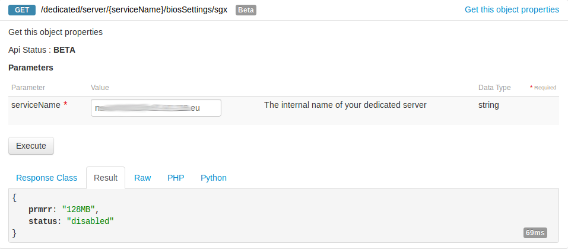
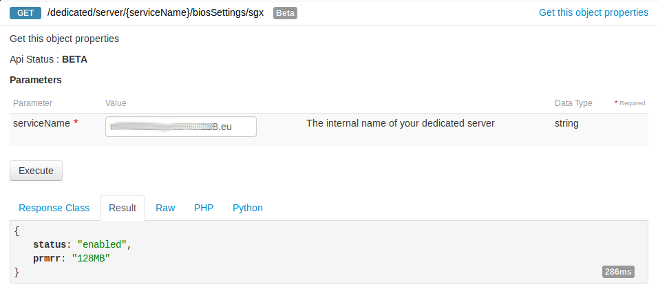

**Last updated October 17th, 2019**

## Objective

Enable Intel Software Guard Extensions on your server, to be able to run SGX-ready applications  
Intel SGX delivers advanced hardware and RAM security encryption features, in order to isolate parts of code and data that are specific to each application

## Requirements

- An [infrastructure dedicated server](https://www.ovh.ie/dedicated_servers/infra/){.external}, with the [SGX](https://www.ovh.ie/dedicated_servers/software-guard-extensions/){.external} option
- Administrative (root) access to the server via SSH
- Access to the [OVH API](https://api.ovh.com/console/){.external}
- Ubuntu 18.04 or similar installed on the server

## Instructions

### Step 1 - Log into the API console

Go to <https://api.ovh.com/console/> and click the `Login`{.action} in the top-right corner of the page.  
On the following page, log in with the credentials of your OVH account.

### Step 2 - Enable SGX

Get the name of your server from the list returned from this call :

> [!api]
>
> @api {GET} /dedicated/server

Verify that your service has the SGX option, by calling : 

> [!api]
>
> @api {GET} /dedicated/server/{serviceName}/biosSettings/sgx

{.thumbnail}

Next, let's enable SGX :

> [!api]
>
> @api {POST} /dedicated/server/{serviceName}/biosSettings/sgx/configure

{.thumbnail}

Check the progress of the configuration task by calling this endpoint with the taskId returned by the previous call :

> [!api]
>
> @api {GET} /dedicated/server/{serviceName}/task/{taskId}

{.thumbnail}

You can verify that the status is now enabled :

> [!api]
>
> @api {GET} /dedicated/server/{serviceName}/biosSettings/sgx

{.thumbnail}

### Step 3 - Reboot to apply the new BIOS settings

### Step 4 - Install the SGX software stack

Now we will install Intel's driver and SDK to be able to develop and run SGX applications.  

First, let's install some dependencies :
```bash
sudo apt-get install build-essential ocaml ocamlbuild automake autoconf libtool wget python libssl-dev libcurl4-openssl-dev protobuf-compiler libprotobuf-dev debhelper cmake git
```

Then, download, build and install the SGX software stack :
```bash
BASE_DIR=/opt/intel
[[ -d $BASE_DIR ]] || sudo mkdir -p $BASE_DIR && sudo chown `whoami` $BASE_DIR
cd $BASE_DIR

git clone https://github.com/intel/linux-sgx.git

cd linux-sgx
git checkout sgx_2.6
./download_prebuilt.sh
make -j 6
make sdk_install_pkg -j 6
make deb_pkg -j 6
$BASE_DIR/linux-sgx/linux/installer/bin/sgx_linux_x64_sdk_2.6.100.51363.bin --prefix=$BASE_DIR/

sudo dpkg -i $BASE_DIR/linux-sgx/linux/installer/deb/libsgx-urts_2.6.100.51363-bionic1_amd64.deb $BASE_DIR/linux-sgx/linux/installer/deb/libsgx-enclave-common_2.6.100.51363-bionic1_amd64.deb
```

Download and install the driver :
```bash
wget https://download.01.org/intel-sgx/linux-2.6/ubuntu18.04-server/sgx_linux_x64_driver_2.5.0_2605efa.bin
chmod +x sgx_linux_x64_driver_2.5.0_2605efa.bin
sudo ./sgx_linux_x64_driver_2.5.0_2605efa.bin
```

### Step 5 - Reboot to finish the installation

### Step 6 - Use a sample application to validate the installation

Build one of the sample apps provided :
```bash
BASE_DIR=/opt/intel
cd $BASE_DIR/sgxsdk/SampleCode/LocalAttestation/
source $BASE_DIR/sgxsdk/environment
make SGX_DEBUG=0 SGX_MODE=HW SGX_PRERELEASE=1
```

Run it :
```bash
ovh@nsXXXX:/opt/intel/sgxsdk/SampleCode/LocalAttestation$ ./app 

Available Enclaves
Enclave1 - EnclaveID 2
Enclave2 - EnclaveID 3
Enclave3 - EnclaveID 4

Secure Channel Establishment between Source (E1) and Destination (E2) Enclaves successful !!!

Enclave to Enclave Call between Source (E1) and Destination (E2) Enclaves successful !!!

Message Exchange between Source (E1) and Destination (E2) Enclaves successful !!!

Secure Channel Establishment between Source (E1) and Destination (E3) Enclaves successful !!!

Enclave to Enclave Call between Source (E1) and Destination (E3) Enclaves successful !!!

Message Exchange between Source (E1) and Destination (E3) Enclaves successful !!!

Secure Channel Establishment between Source (E2) and Destination (E3) Enclaves successful !!!

Enclave to Enclave Call between Source (E2) and Destination (E3) Enclaves successful !!!

Message Exchange between Source (E2) and Destination (E3) Enclaves successful !!!

Secure Channel Establishment between Source (E3) and Destination (E1) Enclaves successful !!!

Enclave to Enclave Call between Source (E3) and Destination (E1) Enclaves successful !!!

Message Exchange between Source (E3) and Destination (E1) Enclaves successful !!!

Close Session between Source (E1) and Destination (E2) Enclaves successful !!!

Close Session between Source (E1) and Destination (E3) Enclaves successful !!!

Close Session between Source (E2) and Destination (E3) Enclaves successful !!!

Close Session between Source (E3) and Destination (E1) Enclaves successful !!!

Hit a key....
```

### Step 7 - Going further

To go further (develop your own application, register for remote attestation, ...), here are some useful resources :

- [Intel SGX](https://software.intel.com/en-us/sgx){.external}
- [Intel SGX Attestation services](https://software.intel.com/en-us/sgx/attestation-services){.external}
- [Intel SGX linux-2.6 documentation](https://download.01.org/intel-sgx/linux-2.6/docs/){.external}
- [github.com/intel/linux-sgx](https://github.com/intel/linux-sgx){.external}
- [github.com/intel/linux-sgx-driver](https://github.com/intel/linux-sgx-driver){.external}
- [github.com/intel/sgx-ra-sample](https://github.com/intel/sgx-ra-sample){.external}
